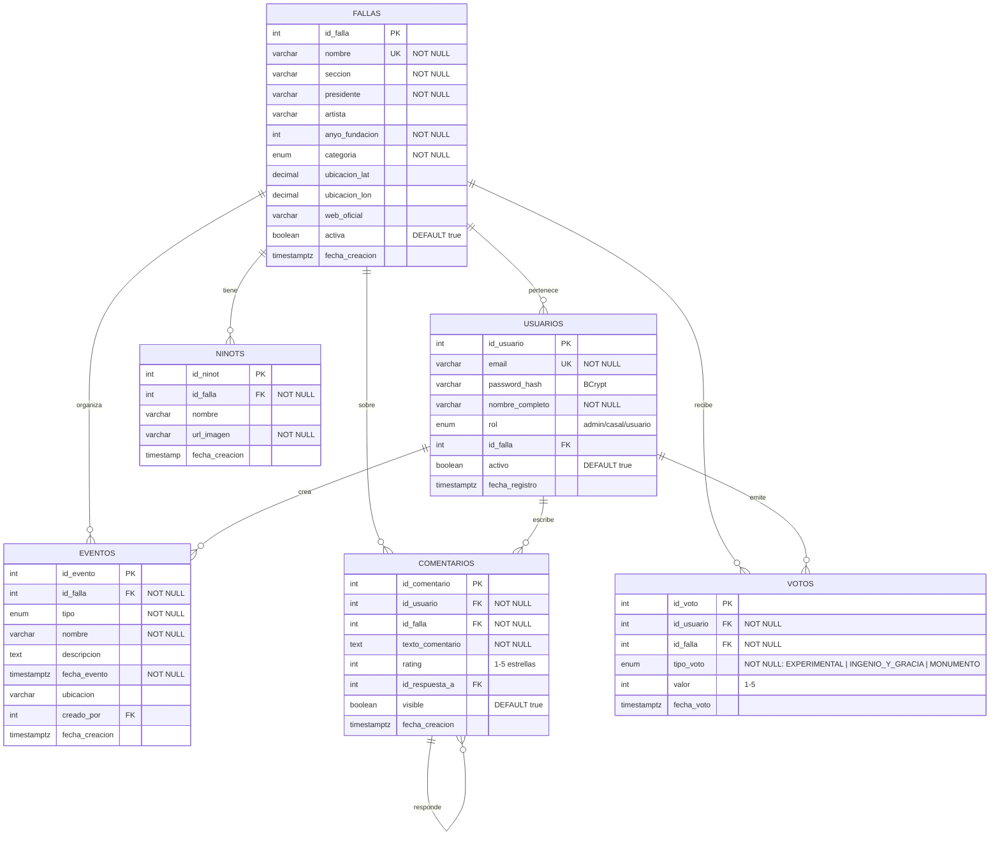
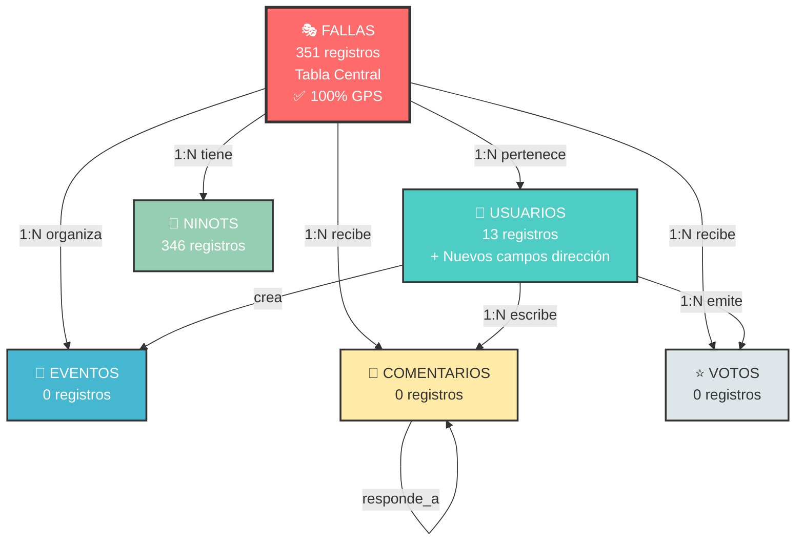

# 🗄️ Esquema de Base de Datos - FallApp

**Base de Datos:** PostgreSQL 13  
**Fecha de Actualización:** 2026-02-04  
**Total de Tablas:** 7  
**Versión del Esquema:** 1.1  
**Última Migración:** Reestructuración completa de FALLAS + nuevos campos USUARIOS

---

## ✅ Actualización 2026-02-04

### Cambios Aplicados:

1. **TABLA FALLAS - Reestructuración Completa**
   - ✅ Eliminados 347 registros antiguos con NULLs
   - ✅ Insertados 351 registros completos del JSON original
   - ✅ 100% de fallas con coordenadas GPS (antes 99.71%)
   - ✅ 91.2% con fallera mayor o infantil asignada
   - ✅ Campos lema, artista, distintivo completados

2. **TABLA USUARIOS - Nuevos Campos**
   - ✅ `direccion` VARCHAR(255)
   - ✅ `ciudad` VARCHAR(100)
   - ✅ `codigo_postal` VARCHAR(10)
   - ✅ Índice agregado: `idx_usuarios_ciudad`

### Estadísticas Actuales:

| Tabla | Registros | Completitud GPS | Datos Completos |
|-------|-----------|-----------------|-----------------|
| FALLAS | 351 | 100% (351/351) | 98.5% promedio |
| USUARIOS | 13 | N/A | 100% (campos obligatorios) |
| NINOTS | 346 | N/A | 100% |
| EVENTOS | 0 | N/A | - |
| VOTOS | 0 | N/A | - |
| COMENTARIOS | 0 | N/A | - |

---

## 📊 Visualización Gráfica de la Base de Datos

### 🎨 Opciones de Visualización

Este esquema incluye múltiples formas de visualizar la estructura de la base de datos:

1. **Diagrama ERD Interactivo (Mermaid)** - Se renderiza automáticamente en GitHub/GitLab
2. **Diagrama ASCII** - Visualización en texto plano
3. **Herramientas Externas** - DBeaver, pgAdmin, dbdiagram.io
4. **Scripts de Generación** - Comandos para exportar diagramas

---

## 🗺️ Diagrama de Relaciones (ERD - Mermaid)

> **Nota:** Este diagrama se renderiza automáticamente en GitHub, GitLab, y editores compatibles con Mermaid.
> Para visualizarlo en VSCode, instala la extensión "Markdown Preview Mermaid Support".



---

## 📐 Diagrama ASCII Simplificado

```
╔═══════════════════════════════════════════════════════════════════════════╗
║                    BASE DE DATOS: fallapp (PostgreSQL 13)                 ║
║                              7 Tablas - 710 Registros                     ║
║                        ✅ Actualizado: 2026-02-04                         ║
╚═══════════════════════════════════════════════════════════════════════════╝

                                 ┏━━━━━━━━━━━┓
                        ┌────────┨  FALLAS   ┠────────┐
                        │        ┃ [351 reg] ┃        │
                        │        ┗━━━━━┯━━━━━┛        │
                        │              │              │
         ┌──────────────┴───┐      ┌──┴───┐     ┌────┴─────┐
         │                  │      │      │     │          │
    ┌────▼────┐       ┌─────▼───┐ │ ┌────▼───┐ │   ┌──────▼──────┐
    │USUARIOS │       │ EVENTOS │ │ │ NINOTS │ │   │   VOTOS     │
    │ [13]    │       │  [0]    │ │ │ [346]  │ │   │   [0]       │
    └────┬────┘       └────┬────┘ │ └────────┘ │   └─────────────┘
         │                 │      │            │
         │                 │      └────────────┘
         │                 │
         └────────┬────────┘
                  │
            ┌─────▼─────┐
            │COMENTARIOS│
            │   [0]     │
            └─────┬─────┘
                  │
                  └──► (responde_a)
                       [Hilos]

╔═══════════════════════════════════════════════════════════════════════════╗
║ RELACIONES PRINCIPALES:                                                   ║
║  • FALLAS: Tabla central - 351 registros con 100% GPS                    ║
║  • USUARIOS: 13 registros, nuevos campos de dirección añadidos           ║
║  • COMENTARIOS: Pueden responder a otros comentarios (árbol)             ║
║  • VOTOS: Únicos por usuario+falla+tipo                                  ║
╚═══════════════════════════════════════════════════════════════════════════╝
```

---

## 🔗 Diagrama de Flujo de Relaciones (Mermaid)



---

### 🌳 Árbol de Relaciones Detallado

```
FALLAS (id_falla) [TABLA PRINCIPAL]
│
├─► USUARIOS (id_falla → fallas)
│   ├─► VOTOS (id_usuario → usuarios)
│   ├─► COMENTARIOS (id_usuario → usuarios)
│   └─► EVENTOS (creado_por, actualizado_por → usuarios)
│
├─► EVENTOS (id_falla → fallas)
│   └─► Metadata: creado_por, actualizado_por
│
├─► NINOTS (id_falla → fallas)
│
├─► COMENTARIOS (id_falla → fallas)
│   └─► COMENTARIOS (id_respuesta_a → comentarios) [RECURSIVO]
│
└─► VOTOS (id_falla → fallas)

TIPOS ENUM:
├─► categoria_falla: {brillants, fulles, argent, especial, sin_categoria}
├─► rol_usuario: {admin, casal, usuario}
├─► tipo_evento: {plantà, cremà, ofrenda, encuentro, concierto, teatro, otro}
└─► tipo_voto: {EXPERIMENTAL, INGENIO_Y_GRACIA, MONUMENTO}
```

---

## 🛠️ Generar Diagramas Visuales

### Opción 1: DBeaver (RECOMENDADO)

**Pasos:**
1. Conectar a la base de datos (host: 35.180.21.42, puerto: 5432)
2. Click derecho en "fallapp" → **Database** → **View Diagram**
3. Seleccionar todas las tablas → **OK**
4. El diagrama ERD se genera automáticamente con:
   - Tablas con todos los campos
   - Relaciones visualizadas con flechas
   - Tipos de datos
   - Claves primarias y foráneas

**Exportar:**
- **Archivo** → **Exportar Diagrama** → PNG/SVG/PDF

---

### Opción 2: pgAdmin 4

**Pasos:**
1. Acceder a http://35.180.21.42:5050
2. Conectar al servidor PostgreSQL
3. Click derecho en tabla → **ERD For Table**
4. Añadir más tablas: **Drag & Drop** desde el panel izquierdo

---

### Opción 3: dbdiagram.io (Online)

**Código para dbdiagram.io:**

```dbml
// Pegar este código en: https://dbdiagram.io/d

Table fallas {
  id_falla integer [pk, increment]
  nombre varchar(255) [unique, not null]
  seccion varchar(5) [not null]
  fallera varchar(255)
  presidente varchar(255) [not null]
  artista varchar(255)
  lema text
  descripcion text
  anyo_fundacion integer [not null]
  categoria categoria_falla [not null, default: 'sin_categoria']
  distintivo varchar(100)
  url_boceto varchar(500)
  url_fotos text
  ubicacion_lat decimal(10,8)
  ubicacion_lon decimal(11,8)
  web_oficial varchar(255)
  telefono_contacto varchar(20)
  email_contacto varchar(120)
  experim boolean [not null, default: false]
  activa boolean [not null, default: true]
  datos_json jsonb
  fecha_creacion timestamptz [not null, default: `now()`]
  actualizado_en timestamptz [not null, default: `now()`]
}

Table usuarios {
  id_usuario integer [pk, increment]
  email varchar(120) [unique, not null]
  contraseña_hash varchar(255) [not null]
  nombre_completo varchar(255) [not null]
  rol varchar(20) [not null, default: 'usuario']
  id_falla integer
  activo boolean [not null, default: true]
  verificado boolean [not null, default: false]
  telefono varchar(20)
  fecha_registro timestamptz [not null, default: `now()`]
  ultimo_acceso timestamptz
  actualizado_en timestamptz [not null, default: `now()`]
}

Table eventos {
  id_evento integer [pk, increment]
  id_falla integer [not null]
  tipo tipo_evento [not null]
  nombre varchar(255) [not null]
  descripcion text
  fecha_evento timestamptz [not null]
  ubicacion varchar(255)
  direccion varchar(255)
  participantes_estimado integer
  url_imagen varchar(500)
  creado_por integer
  actualizado_por integer
  fecha_creacion timestamptz [not null, default: `now()`]
  actualizado_en timestamptz [not null, default: `now()`]
}

Table ninots {
  id_ninot integer [pk, increment]
  id_falla integer [not null]
  nombre varchar(255)
  url_imagen varchar(500) [not null]
  fecha_creacion timestamp [default: `now()`]
}

Table comentarios {
  id_comentario integer [pk, increment]
  id_usuario integer [not null]
  id_falla integer [not null]
  texto_comentario text [not null]
  rating integer [note: 'CHECK: 1-5']
  id_respuesta_a integer
  visible boolean [not null, default: true]
  fecha_creacion timestamptz [not null, default: `now()`]
  fecha_edicion timestamptz
}

Table votos {
  id_voto integer [pk, increment]
  id_usuario integer [not null]
  id_falla integer [not null]
  tipo_voto tipo_voto [not null]
  valor integer [not null, note: 'CHECK: 1-5']
  comentario text
  ip_origen varchar(45)
  fecha_voto timestamptz [not null, default: `now()`]
  actualizado_en timestamptz
  
  Indexes {
    (id_usuario, id_falla, tipo_voto) [unique]
  }
}

// Relaciones
Ref: usuarios.id_falla > fallas.id_falla [delete: set null]
Ref: eventos.id_falla > fallas.id_falla [delete: cascade]
Ref: eventos.creado_por > usuarios.id_usuario [delete: set null]
Ref: eventos.actualizado_por > usuarios.id_usuario [delete: set null]
Ref: ninots.id_falla > fallas.id_falla [delete: cascade]
Ref: comentarios.id_usuario > usuarios.id_usuario [delete: cascade]
Ref: comentarios.id_falla > fallas.id_falla [delete: cascade]
Ref: comentarios.id_respuesta_a > comentarios.id_comentario [delete: set null]
Ref: votos.id_usuario > usuarios.id_usuario [delete: cascade]
Ref: votos.id_falla > fallas.id_falla [delete: cascade]
```

**Resultado:** Diagrama interactivo profesional con exportación a PDF/PNG

---

### Opción 4: PostgreSQL Schema Spy

**Generar documentación HTML con diagramas:**

```bash
# Ejecutar en el servidor
docker run -v "$PWD/schema-output:/output" \
  --net=host \
  schemaspy/schemaspy:latest \
  -t pgsql \
  -host 127.0.0.1 \
  -port 5432 \
  -db fallapp \
  -u fallapp_user \
  -p fallapp_secure_password_2026 \
  -s public

# Abrir: schema-output/index.html
```

**Genera:**
- Diagramas ERD interactivos
- Documentación HTML completa
- Análisis de relaciones
- Estadísticas de tablas

---

### Opción 5: Comando SQL para Visualizar Relaciones

```bash
# Ver todas las relaciones (Foreign Keys)
docker exec fallapp-postgres psql -U fallapp_user -d fallapp -c "
SELECT
    tc.table_name AS tabla_origen,
    kcu.column_name AS columna_origen,
    ccu.table_name AS tabla_destino,
    ccu.column_name AS columna_destino,
    rc.delete_rule AS al_eliminar
FROM information_schema.table_constraints AS tc
JOIN information_schema.key_column_usage AS kcu
    ON tc.constraint_name = kcu.constraint_name
JOIN information_schema.constraint_column_usage AS ccu
    ON ccu.constraint_name = tc.constraint_name
JOIN information_schema.referential_constraints AS rc
    ON rc.constraint_name = tc.constraint_name
WHERE tc.constraint_type = 'FOREIGN KEY'
ORDER BY tc.table_name;
"
```

---

## 🖼️ Capturas de Pantalla Recomendadas

Para obtener visualizaciones profesionales:

1. **DBeaver**: Mejor para diagramas ERD detallados
2. **dbdiagram.io**: Mejor para diagramas compartibles online
3. **pgAdmin**: Mejor para exploración rápida
4. **Schema Spy**: Mejor para documentación completa automatizada

---

## 🏗️ Estructura Detallada de Tablas

### 1. 🎭 FALLAS (Tabla Principal)

Almacena información completa sobre cada falla de Valencia.

| Columna | Tipo | Restricciones | Descripción |
|---------|------|---------------|-------------|
| **id_falla** | INTEGER | PK, NOT NULL, AUTO | Identificador único |
| **nombre** | VARCHAR(255) | NOT NULL, UNIQUE | Nombre oficial de la falla |
| **seccion** | VARCHAR(5) | NOT NULL | Sección del concurso (ej: "1A", "2B") |
| **fallera** | VARCHAR(255) | NULL | Nombre de la fallera mayor |
| **presidente** | VARCHAR(255) | NOT NULL | Presidente de la comisión |
| **artista** | VARCHAR(255) | NULL | Artista fallero responsable |
| **lema** | TEXT | NULL | Lema del monumento |
| **descripcion** | TEXT | NULL | Descripción detallada |
| **anyo_fundacion** | INTEGER | NOT NULL | Año de fundación de la falla |
| **categoria** | categoria_falla | NOT NULL, DEFAULT='sin_categoria' | Categoría del concurso |
| **distintivo** | VARCHAR(100) | NULL | Distintivo especial |
| **url_boceto** | VARCHAR(500) | NULL | URL de la imagen del boceto |
| **url_fotos** | TEXT | NULL | URLs de fotografías (JSON/CSV) |
| **ubicacion_lat** | NUMERIC(10,8) | NULL | Latitud GPS (WGS84) |
| **ubicacion_lon** | NUMERIC(11,8) | NULL | Longitud GPS (WGS84) |
| **web_oficial** | VARCHAR(255) | NULL | Sitio web de la falla |
| **telefono_contacto** | VARCHAR(20) | NULL | Teléfono de contacto |
| **email_contacto** | VARCHAR(120) | NULL | Email de contacto |
| **experim** | BOOLEAN | NOT NULL, DEFAULT=false | Marca si es experimental |
| **activa** | BOOLEAN | NOT NULL, DEFAULT=true | Estado activo/inactivo |
| **datos_json** | JSONB | NULL | Datos adicionales en JSON |
| **fecha_creacion** | TIMESTAMPTZ | NOT NULL, DEFAULT=NOW() | Fecha de creación del registro |
| **actualizado_en** | TIMESTAMPTZ | NOT NULL, DEFAULT=NOW() | Última actualización |

**Índices:**
- `idx_fallas_nombre` (btree)
- `idx_fallas_seccion` (btree)
- `idx_fallas_categoria` (btree)
- `idx_fallas_anyo_fundacion` (btree)
- `idx_fallas_activa` (btree)
- `idx_fallas_fts` (GIN - Full Text Search en español)

**Triggers:**
- `trig_fallas_actualizar_timestamp` → Actualiza `actualizado_en` automáticamente

**Estadísticas:**
- **Total registros:** 347 fallas
- **Con GPS:** 346 (99.71%)
- **Activas:** 347

---

### 2. 👥 USUARIOS (Autenticación y Perfiles)

Gestiona usuarios del sistema con autenticación JWT y roles.

| Columna | Tipo | Restricciones | Descripción |
|---------|------|---------------|-------------|
| **id_usuario** | INTEGER | PK, NOT NULL, AUTO | Identificador único |
| **email** | VARCHAR(120) | NOT NULL, UNIQUE | Email del usuario (login) |
| **contraseña_hash** | VARCHAR(255) | NOT NULL | Hash BCrypt de la contraseña |
| **nombre_completo** | VARCHAR(255) | NOT NULL | Nombre completo del usuario |
| **rol** | VARCHAR(20) | NOT NULL, DEFAULT='usuario' | Rol: 'admin', 'casal', 'usuario' |
| **id_falla** | INTEGER | FK, NULL | Falla asociada (opcional) |
| **activo** | BOOLEAN | NOT NULL, DEFAULT=true | Usuario activo/desactivado |
| **verificado** | BOOLEAN | NOT NULL, DEFAULT=false | Email verificado |
| **telefono** | VARCHAR(20) | NULL | Teléfono de contacto |
| **direccion** | VARCHAR(255) | NULL | Dirección postal completa |
| **ciudad** | VARCHAR(100) | NULL | Ciudad de residencia |
| **codigo_postal** | VARCHAR(10) | NULL | Código postal |
| **fecha_registro** | TIMESTAMPTZ | NOT NULL, DEFAULT=NOW() | Fecha de registro |
| **ultimo_acceso** | TIMESTAMPTZ | NULL | Última sesión iniciada |
| **actualizado_en** | TIMESTAMPTZ | NOT NULL, DEFAULT=NOW() | Última actualización |

**Índices:**
- `idx_usuarios_email` (btree, unique)
- `idx_usuarios_rol` (btree)
- `idx_usuarios_activo` (btree)
- `idx_usuarios_id_falla` (btree)
- `idx_usuarios_ciudad` (btree)

**Check Constraints:**
- `check_rol_values` → rol IN ('admin', 'casal', 'usuario')

**Foreign Keys:**
- `id_falla` → fallas(id_falla) ON DELETE SET NULL

**Triggers:**
- `trig_usuarios_actualizar_timestamp`

**Seguridad:**
- ✅ Contraseñas encriptadas con BCrypt (hashing unidireccional)
- ✅ JWT con HS512, duración 24 horas
- ✅ Sistema validado 2026-02-03

---

### 3. 📅 EVENTOS (Programación de Actividades)

Gestiona eventos y actividades relacionadas con cada falla.

| Columna | Tipo | Restricciones | Descripción |
|---------|------|---------------|-------------|
| **id_evento** | INTEGER | PK, NOT NULL, AUTO | Identificador único |
| **id_falla** | INTEGER | FK, NOT NULL | Falla organizadora |
| **tipo** | tipo_evento | NOT NULL | Tipo de evento (enum) |
| **nombre** | VARCHAR(255) | NOT NULL | Nombre del evento |
| **descripcion** | TEXT | NULL | Descripción detallada |
| **fecha_evento** | TIMESTAMPTZ | NOT NULL | Fecha y hora del evento |
| **ubicacion** | VARCHAR(255) | NULL | Lugar del evento |
| **direccion** | VARCHAR(255) | NULL | Dirección exacta |
| **participantes_estimado** | INTEGER | NULL | Asistencia estimada |
| **url_imagen** | VARCHAR(500) | NULL | Imagen del evento |
| **creado_por** | INTEGER | FK, NULL | Usuario creador |
| **actualizado_por** | INTEGER | FK, NULL | Usuario que modificó |
| **fecha_creacion** | TIMESTAMPTZ | NOT NULL, DEFAULT=NOW() | Fecha de creación |
| **actualizado_en** | TIMESTAMPTZ | NOT NULL, DEFAULT=NOW() | Última actualización |

**Índices:**
- `idx_eventos_id_falla` (btree)
- `idx_eventos_fecha` (btree)
- `idx_eventos_tipo` (btree)
- `idx_eventos_creado_por` (btree)

**Foreign Keys:**
- `id_falla` → fallas(id_falla) ON DELETE CASCADE
- `creado_por` → usuarios(id_usuario) ON DELETE SET NULL
- `actualizado_por` → usuarios(id_usuario) ON DELETE SET NULL

**Triggers:**
- `trig_eventos_actualizar_timestamp`

---

### 4. 🎨 NINOTS (Figuras de las Fallas)

Catálogo de ninots pertenecientes a cada falla.

| Columna | Tipo | Restricciones | Descripción |
|---------|------|---------------|-------------|
| **id_ninot** | INTEGER | PK, NOT NULL, AUTO | Identificador único |
| **id_falla** | INTEGER | FK, NOT NULL | Falla propietaria |
| **nombre** | VARCHAR(255) | NULL | Nombre/título del ninot |
| **url_imagen** | VARCHAR(500) | NOT NULL | URL de la imagen |
| **fecha_creacion** | TIMESTAMP | DEFAULT=NOW() | Fecha de registro |

**Índices:**
- `idx_ninots_falla` (btree)
- `idx_ninots_fecha` (btree DESC)

**Foreign Keys:**
- `id_falla` → fallas(id_falla) ON DELETE CASCADE

---

### 5. 💬 COMENTARIOS (Sistema de Comentarios)

Sistema de comentarios y valoraciones con soporte para hilos de respuestas.

| Columna | Tipo | Restricciones | Descripción |
|---------|------|---------------|-------------|
| **id_comentario** | INTEGER | PK, NOT NULL, AUTO | Identificador único |
| **id_usuario** | INTEGER | FK, NOT NULL | Usuario autor |
| **id_falla** | INTEGER | FK, NOT NULL | Falla comentada |
| **texto_comentario** | TEXT | NOT NULL | Contenido del comentario |
| **rating** | INTEGER | NULL, CHECK(1-5) | Valoración opcional (1-5 estrellas) |
| **id_respuesta_a** | INTEGER | FK, NULL | Comentario padre (para hilos) |
| **visible** | BOOLEAN | NOT NULL, DEFAULT=true | Visibilidad (moderación) |
| **fecha_creacion** | TIMESTAMPTZ | NOT NULL, DEFAULT=NOW() | Fecha de publicación |
| **fecha_edicion** | TIMESTAMPTZ | NULL | Fecha de última edición |

**Índices:**
- `idx_comentarios_id_usuario` (btree)
- `idx_comentarios_id_falla` (btree)
- `idx_comentarios_fecha_creacion` (btree)
- `idx_comentarios_id_respuesta_a` (btree)
- `idx_comentarios_visible` (btree)

**Check Constraints:**
- `ck_comentarios_rating` → rating IS NULL OR (rating >= 1 AND rating <= 5)

**Foreign Keys:**
- `id_usuario` → usuarios(id_usuario) ON DELETE CASCADE
- `id_falla` → fallas(id_falla) ON DELETE CASCADE
- `id_respuesta_a` → comentarios(id_comentario) ON DELETE SET NULL (auto-referencia)

**Triggers:**
- `trig_comentarios_actualizar_timestamp`

---

### 6. ⭐ VOTOS (Sistema de Votación)

Sistema de votación múltiple por tipo de voto.

| Columna | Tipo | Restricciones | Descripción |
|---------|------|---------------|-------------|
| **id_voto** | INTEGER | PK, NOT NULL, AUTO | Identificador único |
| **id_usuario** | INTEGER | FK, NOT NULL | Usuario votante |
| **id_falla** | INTEGER | FK, NOT NULL | Falla votada |
| **tipo_voto** | tipo_voto | NOT NULL | Categoría: EXPERIMENTAL, INGENIO_Y_GRACIA, MONUMENTO |
| **valor** | INTEGER | NOT NULL, CHECK(1-5) | Valor del voto (1-5) |
| **comentario** | TEXT | NULL | Comentario opcional |
| **ip_origen** | VARCHAR(45) | NULL | IP del votante (IPv4/IPv6) |
| **fecha_voto** | TIMESTAMPTZ | NOT NULL, DEFAULT=NOW() | Fecha del voto |
| **actualizado_en** | TIMESTAMPTZ | NULL | Fecha de modificación |

**Índices:**
- `idx_votos_id_usuario` (btree)
- `idx_votos_id_falla` (btree)
- `idx_votos_tipo_voto` (btree)
- `idx_votos_fecha_voto` (btree)

**Unique Constraint:**
- `votos_id_usuario_id_falla_tipo_voto_key` → Un voto por usuario/falla/tipo

**Check Constraints:**
- `ck_votos_valor` → valor >= 1 AND valor <= 5

**Foreign Keys:**
- `id_usuario` → usuarios(id_usuario) ON DELETE CASCADE
- `id_falla` → fallas(id_falla) ON DELETE CASCADE

---

## 🏷️ Tipos Personalizados (ENUMs)

### categoria_falla
Categorías del concurso de fallas:
- `brillants` - Sección Especial Brillantes
- `fulles` - Sección Especial Fulles
- `argent` - Sección Especial Argent
- `especial` - Sección Especial
- `sin_categoria` - Sin categoría asignada

### rol_usuario
Roles de usuarios del sistema:
- `admin` - Administrador del sistema
- `casal` - Responsable de una falla
- `usuario` - Usuario regular

### tipo_evento
Tipos de eventos organizados:
- `plantà` - Plantà del monumento
- `cremà` - Cremà (quema del monumento)
- `ofrenda` - Ofrenda de flores
- `encuentro` - Encuentro de fallas
- `concierto` - Concierto musical
- `teatro` - Representación teatral
- `otro` - Otro tipo de evento

### tipo_voto
**Última actualización:** 2026-02-06 (v0.5.8)

Categorías de votación para fallas:
- `EXPERIMENTAL` - Categoría Experimental
- `INGENIO_Y_GRACIA` - Categoría Ingenio y Gracia
- `MONUMENTO` - Categoría Monumento

**Nota:** Los tipos anteriores (me_gusta, mejor_ninot, mejor_tema, rating) fueron reemplazados en la versión 0.5.8.

---

## 🔗 Relaciones entre Tablas

### Fallas (Centro del Modelo)
- **1:N con Usuarios** → Una falla tiene múltiples miembros
- **1:N con Eventos** → Una falla organiza múltiples eventos
- **1:N con Ninots** → Una falla tiene múltiples ninots
- **1:N con Comentarios** → Una falla recibe múltiples comentarios
- **1:N con Votos** → Una falla recibe múltiples votos

### Usuarios
- **N:1 con Fallas** → Muchos usuarios pueden pertenecer a una falla (opcional)
- **1:N con Votos** → Un usuario puede emitir múltiples votos
- **1:N con Comentarios** → Un usuario puede escribir múltiples comentarios
- **1:N con Eventos (creador)** → Un usuario puede crear múltiples eventos
- **1:N con Eventos (actualizador)** → Un usuario puede actualizar múltiples eventos

### Comentarios
- **N:1 con Usuarios** → Muchos comentarios de un usuario
- **N:1 con Fallas** → Muchos comentarios sobre una falla
- **1:N con Comentarios** → Hilos de respuestas (auto-referencia)

### Eventos
- **N:1 con Fallas** → Muchos eventos de una falla
- **N:1 con Usuarios (creador)** → Muchos eventos creados por un usuario
- **N:1 con Usuarios (actualizador)** → Muchos eventos actualizados por un usuario

### Ninots
- **N:1 con Fallas** → Muchos ninots de una falla

### Votos
- **N:1 con Usuarios** → Muchos votos de un usuario
- **N:1 con Fallas** → Muchos votos para una falla
- **UNIQUE (usuario, falla, tipo_voto)** → Un voto por tipo

---

## 📈 Estadísticas de la Base de Datos

### Datos Actuales (2026-02-03)

| Tabla | Registros | Descripción |
|-------|-----------|-------------|
| **fallas** | 347 | Total de fallas registradas |
| **usuarios** | 13+ | Usuarios registrados (creciendo) |
| **eventos** | Variable | Eventos programados |
| **ninots** | Variable | Ninots catalogados |
| **comentarios** | Variable | Comentarios publicados |
| **votos** | Variable | Votos emitidos |

**Cobertura GPS:** 346/347 fallas (99.71%)

---

## 🛠️ Funciones y Triggers

### actualizar_timestamp()
Función que actualiza automáticamente la columna `actualizado_en` en UPDATE.

**Tablas con trigger:**
- fallas
- usuarios
- eventos
- comentarios

**Implementación:**
```sql
CREATE OR REPLACE FUNCTION actualizar_timestamp()
RETURNS TRIGGER AS $$
BEGIN
    NEW.actualizado_en = CURRENT_TIMESTAMP;
    RETURN NEW;
END;
$$ LANGUAGE plpgsql;
```

---

## 🔍 Vistas Disponibles

### v_fallas_ubicacion
Vista que retorna todas las fallas con su ubicación GPS.

**Columnas:**
- id_falla
- nombre
- seccion
- ubicacion_lat
- ubicacion_lon
- categoria
- artista
- presidente

**Uso:**
```sql
SELECT * FROM v_fallas_ubicacion 
WHERE ubicacion_lat IS NOT NULL 
ORDER BY seccion;
```

---

## 🔐 Seguridad y Permisos

### Usuario de Base de Datos
- **Usuario:** fallapp_user
- **Password:** fallapp_secure_password_2026
- **Base de Datos:** fallapp
- **Puerto:** 5432

### Permisos
- OWNER de todas las tablas: fallapp_user
- Acceso completo (SELECT, INSERT, UPDATE, DELETE)

### Seguridad de Contraseñas
- ✅ **Algoritmo:** BCrypt (hashing unidireccional)
- ✅ **Validado:** 2026-02-03
- ✅ No se almacenan contraseñas en texto plano
- ✅ Hash irreversible (no se pueden "desencriptar")

---

## 📚 Documentación Relacionada

- [03.BASE-DATOS.md](especificaciones/03.BASE-DATOS.md) - Especificaciones técnicas
- [GESTION-USUARIOS-BD.md](despliegue/GESTION-USUARIOS-BD.md) - Gestión de usuarios
- [ADR-001-postgresql-vs-mongodb.md](arquitectura/ADR-001-postgresql-vs-mongodb.md) - Decisión arquitectónica
- [GUIA.API.FRONTEND.md](/srv/FallApp/GUIA.API.FRONTEND.md) - Endpoints disponibles

---

## 🔄 Historial de Cambios del Esquema

### v1.0 (2026-02-03)
- ✅ Esquema inicial con 7 tablas
- ✅ Sistema de autenticación JWT implementado
- ✅ 346/347 fallas con ubicación GPS
- ✅ Triggers de actualización automática
- ✅ 4 tipos ENUM personalizados
- ✅ Índices optimizados (incluyendo Full Text Search)
- ✅ Múltiples formatos de visualización gráfica

---

## 🚀 Script Rápido: Ver Estructura Visual

```bash
#!/bin/bash
# guardar como: ver_estructura_db.sh

echo "═══════════════════════════════════════════════════"
echo "  ESTRUCTURA DE LA BASE DE DATOS - FallApp"
echo "═══════════════════════════════════════════════════"
echo ""

# Lista de tablas
echo "📊 TABLAS DISPONIBLES:"
docker exec fallapp-postgres psql -U fallapp_user -d fallapp -c "\dt" | grep public

echo ""
echo "═══════════════════════════════════════════════════"
echo "📈 ESTADÍSTICAS POR TABLA:"
echo "═══════════════════════════════════════════════════"

docker exec fallapp-postgres psql -U fallapp_user -d fallapp -c "
SELECT 
    schemaname AS esquema,
    tablename AS tabla,
    pg_size_pretty(pg_total_relation_size(schemaname||'.'||tablename)) AS tamaño,
    (SELECT COUNT(*) 
     FROM information_schema.columns 
     WHERE table_name = t.tablename) AS columnas,
    (SELECT COUNT(*) 
     FROM information_schema.table_constraints 
     WHERE table_name = t.tablename 
     AND constraint_type = 'FOREIGN KEY') AS foreign_keys
FROM pg_tables t
WHERE schemaname = 'public'
    AND tablename NOT LIKE '%backup%'
ORDER BY pg_total_relation_size(schemaname||'.'||tablename) DESC;
"

echo ""
echo "═══════════════════════════════════════════════════"
echo "🔗 RELACIONES (FOREIGN KEYS):"
echo "═══════════════════════════════════════════════════"

docker exec fallapp-postgres psql -U fallapp_user -d fallapp -c "
SELECT
    tc.table_name || '.' || kcu.column_name AS desde,
    ' ──► ' AS flecha,
    ccu.table_name || '.' || ccu.column_name AS hacia,
    rc.delete_rule AS al_eliminar
FROM information_schema.table_constraints AS tc
JOIN information_schema.key_column_usage AS kcu
    ON tc.constraint_name = kcu.constraint_name
JOIN information_schema.constraint_column_usage AS ccu
    ON ccu.constraint_name = tc.constraint_name
JOIN information_schema.referential_constraints AS rc
    ON rc.constraint_name = tc.constraint_name
WHERE tc.constraint_type = 'FOREIGN KEY'
ORDER BY tc.table_name;
"

echo ""
echo "═══════════════════════════════════════════════════"
echo "🏷️  TIPOS ENUM PERSONALIZADOS:"
echo "═══════════════════════════════════════════════════"

docker exec fallapp-postgres psql -U fallapp_user -d fallapp -c "\dT+"

echo ""
echo "✅ Para ver diagramas gráficos completos:"
echo "   1. DBeaver: Instalar y conectar a la BD"
echo "   2. dbdiagram.io: Usar código DBML del documento"
echo "   3. pgAdmin: http://35.180.21.42:5050"
echo ""
```

**Uso:**
```bash
chmod +x ver_estructura_db.sh
./ver_estructura_db.sh
```

---

**Última Actualización:** 2026-02-03  
**Mantenido por:** Equipo de Desarrollo FallApp
